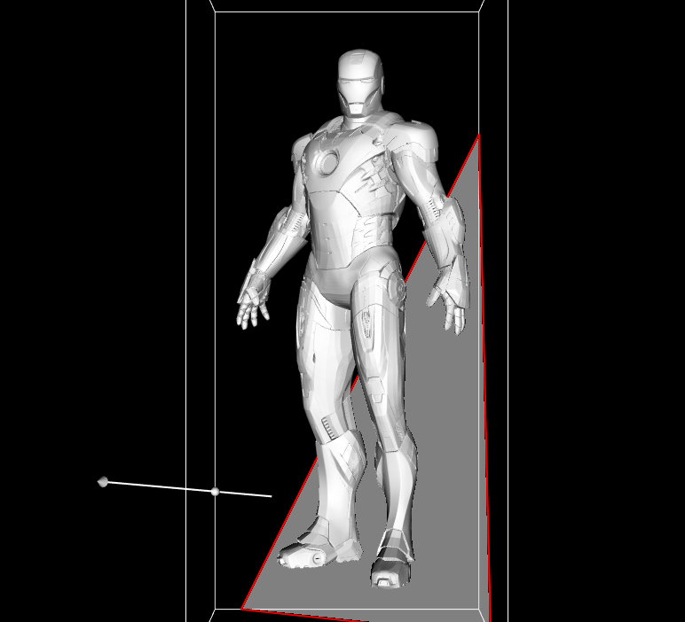

# Лабораторные работы по курсу `advanced computer graphics`

## Лабораторная работа #1

Визулизация 3D данных с помощью [VTK](https://vtk.org/).
Модели (бесплатные) взяты со свободного [ресурса](https://www.cgtrader.com/free-3d-models).

