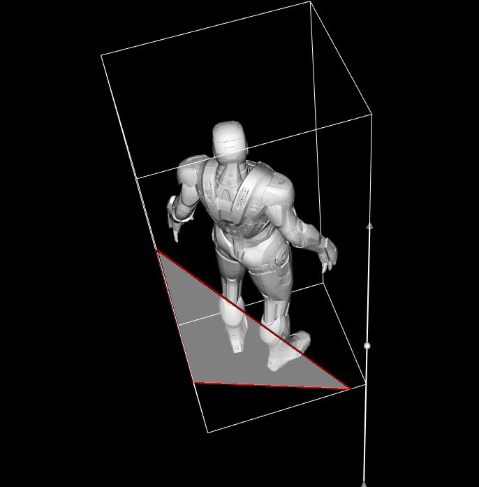

# Лабораторная работа #1

## Данные
Модель представляется в виде набора файлов формата `.stl` 
(всего 5 файлов, на разные части костюма).

## Фильтр
В качестве фильтра применялся `vtkAppendPolyData`, который
объединяет полигональный датасет, состоящий из нескольких
файлов.

## Виджет
Выбран `vtkImplicitPlaneWidget`, который 
предназначен для интерактивного отсечения полигональных
данных плоскостью.

